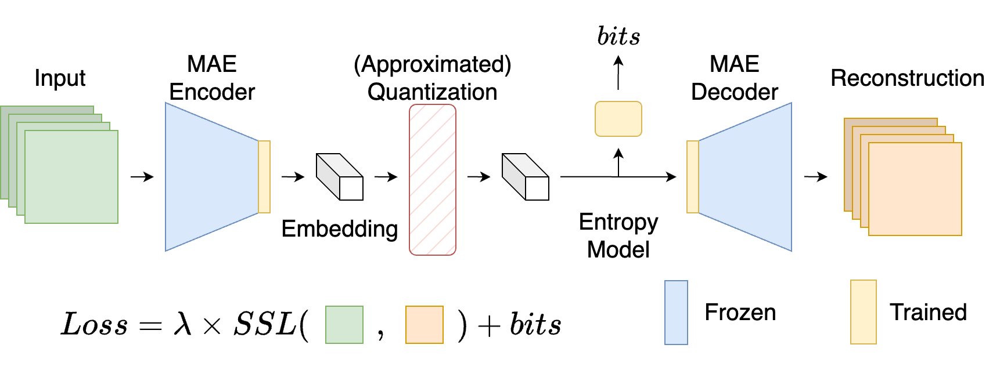
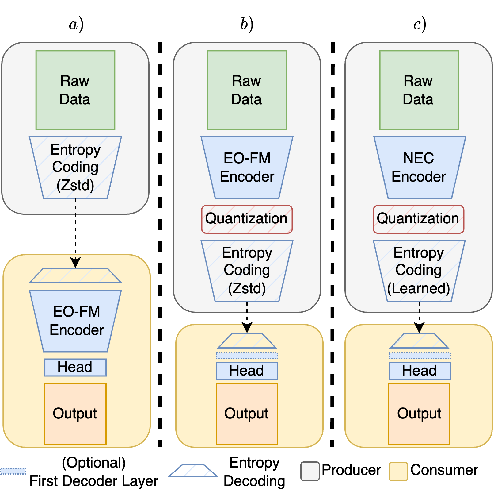
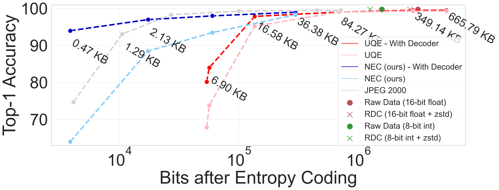
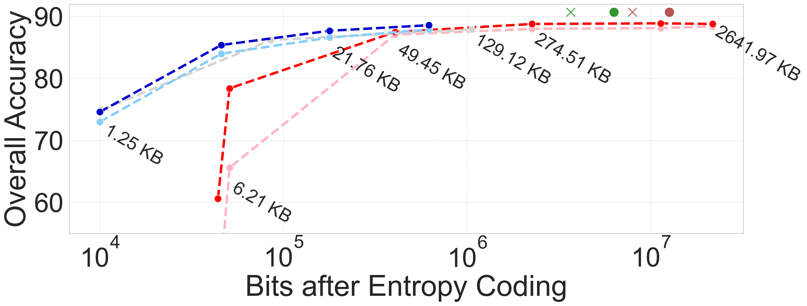
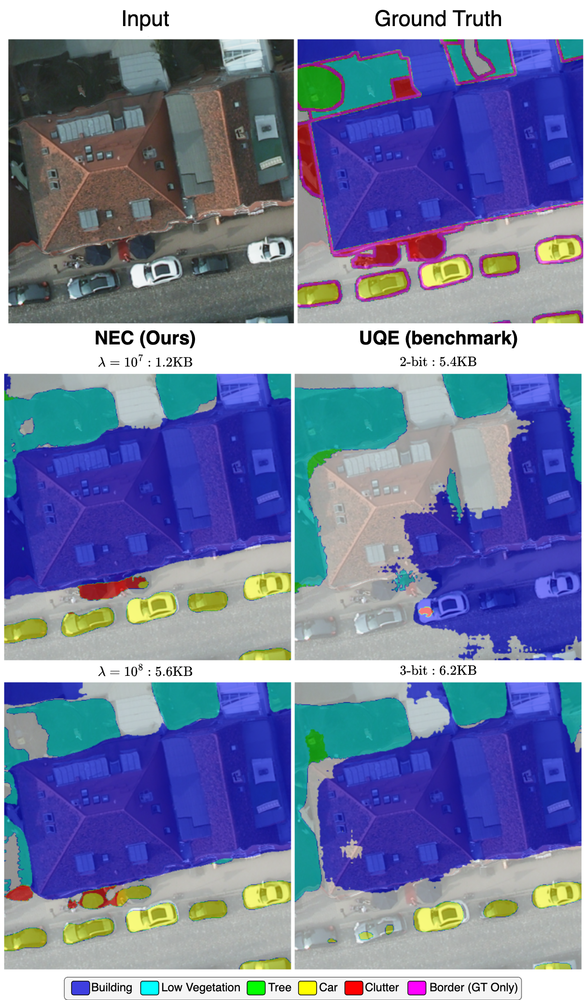

# Neural Embedding Compression for Efficient Multi-Task Earth Observation Modelling

https://arxiv.org/abs/2403.17886

## Carlos Gomes, Thomas Brunschwiler

### Abstract

As repositories of large scale data in earth observation (EO) have grown, so have transfer and storage costs for model training and inference, expending significant resources. We introduce Neural Embedding Compression (NEC), based on the transfer of compressed embeddings to data consumers instead of raw data. We adapt foundation models (FM) through learned neural compression to generate multi-task embeddings while navigating the tradeoff between compression rate and embedding utility. We update only a small fraction of the FM parameters (10%) for a short training period (1% of the iterations of pre-training). We evaluate NEC on two EO tasks: scene classification and semantic segmentation. Compared with applying traditional compression to the raw data, NEC achieves similar accuracy with a 75% to 90% reduction in data. Even at 99.7% compression, performance drops by only 5% on the scene classification task. Overall, NEC is a data-efficient yet performant approach for multi-task EO modelling.

### Architecture



### Usage

Environment:

- Python 3.8.13
- Pytorch 1.11.0
- torchvision 0.12.0
- timm 0.9.12
- mmcv-full 1.5.0
- compressai 1.2.4
- `pip install -e .`

#### Pretraining & Finetuning-Classification

From the `MAEPretrain_SceneClassification` directory.

##### Pretraining (4 × A100 GPUs, 1 day)

1. (From https://github.com/ViTAE-Transformer/Remote-Sensing-RVSA): Preparing the MillionAID: Download the [MillionAID](https://captain-whu.github.io/DiRS/). Here, we use previous `train_labels.txt` and `valid_labels.txt` of the [ViTAE-Transformer-Remote-Sensing](https://github.com/ViTAE-Transformer/ViTAE-Transformer-Remote-Sensing), which contain labels. However, since we conduct the ***unsupervised pretraining***, the labels are not necessary. It is easy for users to record image names and revise corresponding codes `MAEPretrain_SceneClassification/util/datasets.py/class MillionAIDDataset`.

2. You can download the ViT-B pretrained model from https://github.com/ViTAE-Transformer/Remote-Sensing-RVSA.

3. Training:

We train on 4 A100 GPUs. For a single worker:

```sh
torchrun --standalone --nnodes=1 --nproc_per_node=<NUM_TRAINERS> main_compress.py --dataset 'millionAID' --model 'mae_vit_compress_adapter' --epochs 20 --warmup_epochs 0 --data_path <path_to_millionaid> --save_every_n_epochs 2 --num_workers 8 --ld 1e10 --finetune <path_to_pretrained_model> --output_dir <storage path> --log_dir <log storage path> --blr 1.5e-4 --weight_decay 0.05 --input_size 224 --batch_size 256
```

##### Evaluate Compression

Use the `find_average_size.py` script to find the compression metrics for the model on a given dataset.

```sh
python find_average_size.py --model 'mae_vit_compress_adapter' --model_path <path_to_model> --input_size <image_size> --dataset <ucm, MillionAid or potsdam> --entropy --data_path <data_path>
```

`--eval_size` can be used to choose a subset of the data to evaluate on
`--batch_size` determines the number of samples that are compressed jointly.

For the potsdam dataset, the data path is ignored and instead the dataset used is the one specified in `../Semantic Segmentation/configs/vit_compress/potsdam_dataset.py`

##### Finetuning Classification

```sh
python main_finetune.py --dataset 'ucm' --data_path <path to dataset> --model 'vit_base_compressed' --epochs 400 --with_decoder --finetune <path to previously trained model weights> --input_size 256 --batch_size 32 --warmup_epochs 5 --blr 1e-3 --weight_decay 0.05 --split 20 --output_dir <storage path> --log_dir <log storage path>
```

#### Finetuning Segmentation

Since we use MMSegmentation we only provide the necessary config and backbone files.

##### Install MMSegmentation

- Make sure you have the required environment described above

- `git clone https://github.com/open-mmlab/mmsegmentation.git --branch v0.21.0`

- `pip install -U openmim`

- Install mmcv-full with the cuda_version that matches your torch cuda version: `mim install mmcv-full==1.5.0 -f https://download.openmmlab.com/mmcv/dist/{cuda_version}/{torch_version}/index.html`

[Prepare potsdam dataset](https://mmsegmentation.readthedocs.io/en/0.x/dataset_prepare.html#isprs-potsdam)

Edit the `potsdam_dataset.py` configuration file in `configs/vit_compress` so the data_root points to your data directory.

Then put the files under `Sementic Segmentation` in their respective directories for MMSegmentation.
For convenience, we preserve the relative path for users to find files.

For example, add the contents of `Semantic Segmentation/mmseg/models/backbones` to `mmsegmentation/mmseg/models/backbones`

##### Run the training

```sh
python tools/train.py configs/vit_compress/compress.py
```

Or one of the other configs for a different configuration.

### Results

Downstream comparison: a) Raw Data Compression (RDC);  b) Uniformly Quantized Embeddings (UQE); c) Neural Embedding Compression (NEC, ours). "Learned" refers to entropy coding with the distribution learned during training.


#### UC Merced



#### Potsdam



Code for this repository is based on https://github.com/ViTAE-Transformer/Remote-Sensing-RVSA.




## Citation

Please consider citing our work if it is useful for you

```
@ARTICLE{gomes_nec_2024,
  author={Gomes, Carlos and Brunschwiler, Thomas},
  journal={IEEE IGARSS}, 
  title={Neural Embedding Compression For Efficient Multi-Task Earth Observation Modelling}, 
  year={2024}
  }
```

## References

This repository is based on https://github.com/ViTAE-Transformer/Remote-Sensing-RVSA and the original [MAE](https://github.com/facebookresearch/mae) repository.

Compression models are built using the [CompressAI](https://github.com/InterDigitalInc/CompressAI/tree/master) library.
